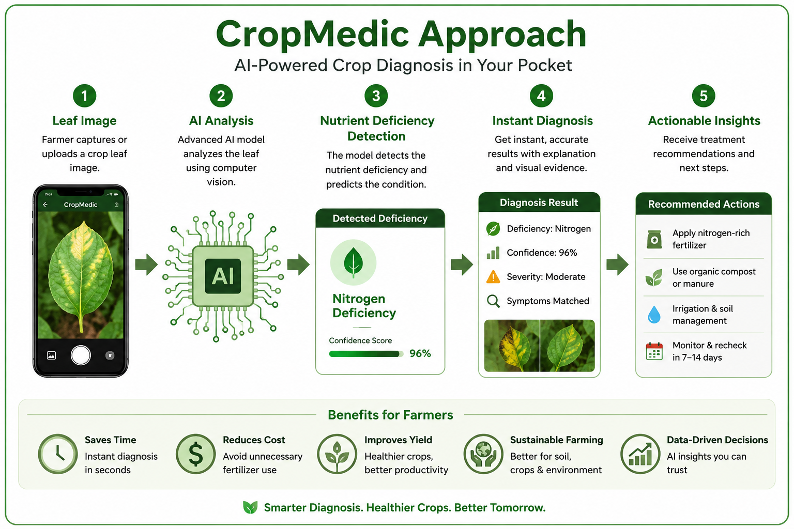
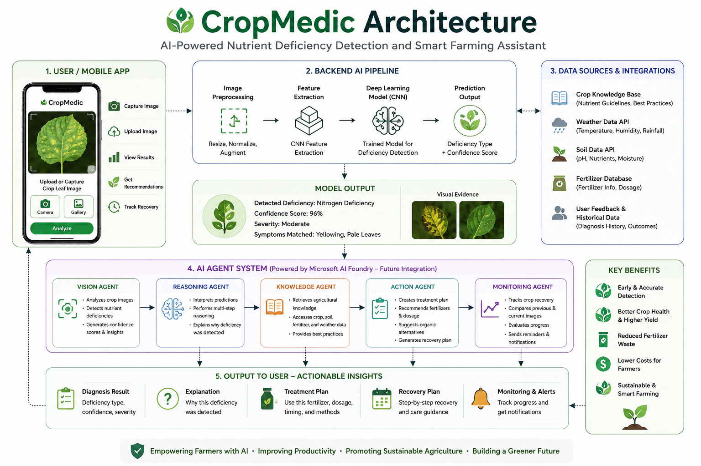

# 🌱 CropMedic – AI-Powered Crop Nutrient Deficiency Detection

### Empowering Farmers with AI-Driven Insights for Healthier Crops and Sustainable Agriculture


## 🚀 Challenge

Creative Apps

## 📌 Problem

Nutrient deficiencies are one of the leading causes of reduced crop productivity worldwide.

Farmers often struggle to identify deficiencies because symptoms such as leaf yellowing, discoloration, and stunted growth appear similar across different nutrient disorders.

This can lead to:

* Reduced crop yield
* Incorrect fertilizer application
* Increased farming costs
* Delayed treatment
* Environmental waste

## 💡 Solution

CropMedic is an AI-powered mobile application that enables farmers to instantly identify nutrient deficiencies using a simple crop leaf image.

Using Computer Vision and Deep Learning, CropMedic analyzes leaf images and provides fast, accurate nutrient deficiency detection directly from a smartphone.

## 📱 How It Works

```text
Capture / Upload Leaf Image
            ↓
      AI Analysis
            ↓
 Nutrient Deficiency Detection
            ↓
     Instant Diagnosis
            ↓
    Actionable Insights
```



## ✨ Key Features

* 📷 Capture crop leaf images
* 🖼 Upload images from gallery
* 🤖 AI-powered nutrient deficiency detection
* 📊 Confidence score prediction
* 📱 Mobile-first user experience
* ⚡ Fast diagnosis
* 🌱 Supports precision agriculture

## 🏗 Architecture



## 🧠 Machine Learning Pipeline

### Data Collection

* Healthy crop leaves
* Nutrient-deficient crop leaves

### Image Preprocessing

* Resize
* Normalize
* Data augmentation
* Horizontal flip
* Zooming
* Shearing

### Model

* Convolutional Neural Network (CNN)
* Feature Extraction
* ReLU Activation
* Dropout Regularization
* Softmax Classification

### Training

* Adam Optimizer
* Learning Rate = 0.001
* Accuracy Metric

## 🛠 Technology Stack

### Mobile Application

* Flutter

### AI / Machine Learning

* Python
* TensorFlow
* Keras
* Computer Vision
* Deep Learning

### Future Integrations

* Microsoft AI Foundry
* Intelligent Recommendations
* Recovery Monitoring
* Weather-Based Insights

## 🌍 Impact

CropMedic helps:

### Farmers

* Detect nutrient deficiencies early
* Improve crop health
* Reduce farming costs

### Agriculture

* Improve productivity
* Reduce fertilizer waste
* Promote sustainable farming

### Society

* Support food security
* Increase access to agricultural technology
* Enable smarter farming decisions

## 🔮 Future Vision

CropMedic is designed to evolve into a smart farming assistant capable of:

* AI-powered recommendations
* Crop recovery monitoring
* Voice-enabled assistance
* Multilingual support
* Weather and soil integration
* Precision agriculture insights

## 🎥 Demo

Add your demo video link here: https://youtu.be/dT9ttBTNoZ8

## 👩‍💻 Author

Sukanya Manoharan

## 🌱 Tagline

**Smarter Diagnosis. Healthier Crops. Better Tomorrow.**
